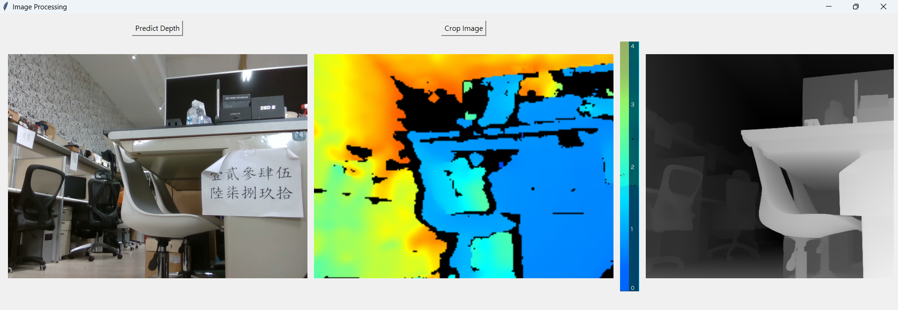
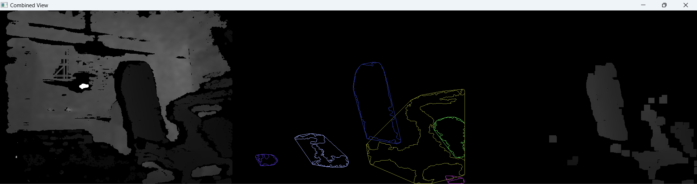

# DepthCamera_application
These programs can work with Intel® RealSense™ Depth Camera D435

## Intro
* camC.py : check if any cameras connect
* CamDis.py : test camera's depth function
* dataCatch.py : catch all type data into 1 pic
* IMGdealing.ipynb : simple way dealing results
* convert.py : cut dataCatch.py's result into 2 pics (color、depth)
* cut.py : try to make different perspective pic to be the same
* Findobstacel.py : using OpenCV fn to find certain distance obstacles

This tow below using depth-anything v2
* camCap.py : real time depth prediction
* depthCorrres.py : using model detect and coresspond with real depth image

## results
* depthCorrres.py

 
* Findobstacel.py

## reference
[[OpenCV基礎][Python]形態學運算(侵蝕、膨脹、梯度)](https://vocus.cc/article/65b7b29dfd8978000195eefc)
